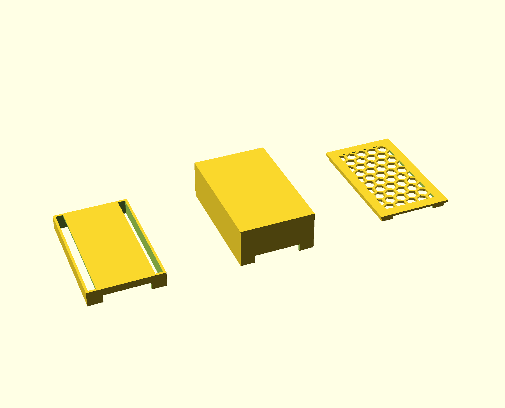

# ESP IoT template

[](./LICENSE.md)

Reusable **ESP IoT template** application based on [ESP-IDF](https://docs.espressif.com/projects/esp-idf/en/latest/esp32/index.html) as a standalone device with a basic feature-set:
 - Over-the-air update via BLE
 - Provisioning via BLE to create or connect to a nearby WIFI Network
 - Handle a single sensor (components/button)
 - Control a single actor (components/lighting)


## Setup

### ESP32

1. Install [Microsoft Visual Code](https://visualstudio.microsoft.com/de/)
2. Open the project folder `esp32` within vscode
3. install the recommended [ESP-IDF extension](https://marketplace.visualstudio.com/items?itemName=espressif.esp-idf-extension)
4. run the Espressif [IDF Setup wizard](https://github.com/espressif/vscode-esp-idf-extension/blob/e88e078f8ad4a0de4ddaed23f6a35cb820fcbf07/docs/SETUP.md#Setup-Wizard)

### Android

1. Install [Android studio](http://d.android.com/studio)
2. Open the project folder `android` within the IDE
3. run a gradle build by invoking `$ ./gradlew installDebug`


## CI/CD

### ESP32
[![Continuous Integration Pipeline [ESP32]](https://github.com/thebino/esp_iot_template/actions/workflows/esp32.yml/badge.svg)](https://github.com/thebino/esp_iot_template/actions/workflows/esp32.yml)

[![Continuous Integration Pipeline [Android]](https://github.com/thebino/esp_iot_template/actions/workflows/android.yml/badge.svg)](https://github.com/thebino/esp_iot_template/actions/workflows/android.yml)

This project is using automated processes known as **continuous integration** and **continuous delivery** (CI/CD) by using [github actions](https://docs.github.com/en/actions/learn-github-actions/understanding-github-actions) 

Pull requests will automatically run *automated tests* on a [self-hosted runner](https://docs.github.com/en/actions/hosting-your-own-runners/about-self-hosted-runners).
Self-hosted runners are used to access custom hardware, in this particular project an ESP32 device to run [target based unit tests](https://docs.espressif.com/projects/esp-idf/en/latest/esp32/api-guides/unit-tests.html) on it.

Testing without a real device is called [Host-based testing](https://docs.espressif.com/projects/esp-idf/en/latest/esp32/api-guides/linux-host-testing.html) and is currently not supported by this template since it is still **experimental**.


## Structure

```shell
├── android                     
├── docs
└── esp32
    ├── components
    │   ├── bluetooth                 Handle communication via bluetooth LE
    │   │   ├── include
    │   │   ├── src
    │   │   └── test
    │   ├── lighting                  Change the state of the LEDs regarding the configuration.
    │   │   ├── include
    │   │   ├── src
    │   │   └── test
    │   ├── button                    Observe button states and react regarding the configuration.
    │   │   ├── include
    │   │   ├── src
    │   │   └── test
    │   └── wifi                      Handle communication via Wireles LAN
    │       ├── include
    │       ├── src
    │       └── test
    ├── host_test                     Test application to run on a Linux Host
    ├── main                          Main application to run on an esp device
    ├── sdkconfig.defaults            Default project configuration
    └── test                          Test application to run on an esp device
```

## Testing

### Target based tests
Run tests on a real device locally connected by build and flash the application inside the `esp32/test` folder.
```shell
idf.py --project-dir esp32/test --build-dir esp32/test/build flash monitor
```

### Linux-host based unit tests
Run host-based test by 
```shell
esp_ble_device/test_host$ idf.py --preview set-target linux
```


## Self-hosted runners
run the following command to get the _cgroup properties_
```shell
ls -l /dev/ | grep tty.usbserial
```


Based on the [ESP-S3-WROOM-1](https://www.espressif.com/sites/default/files/documentation/esp32-s3-wroom-1_wroom-1u_datasheet_en.pdf)


## Summary

- Button 
  Long-press on/off device

- BLE Profile
    OTA Service
      OTA Control
      OTA Data
    Communication Service
      Communication Control
      Communication Data

- Wifi
  start/stop AP


## Features

- [ ] Housing
- [ ] PCB
- [ ] BLE Pairing / Bonding
- [ ] OTA Firmware update
- [ ] Sensor (button / rotary)
- [ ] Actuator (LED Ring / Piezo Buzzer)


## Housing

The case is designed with [OpenSCAD](https://openscad.org) based on this [devkit-v4-case](https://www.printables.com/de/model/73924-esp32-devkit-v4-case-openscad)




## PCB

The PCB is designed with [KiCad](https://www.kicad.org) & [KiCad libraries by Espressif](https://github.com/espressif/kicad-libraries)


## Power supply

 - EREMIT 3.7V 2500mAh LiPo (JST PH 2.0mm)


## Wiring

Rotary
 CLK  4
 DT  15
 SW  13
 +   3V
 GND GND


## Resource

[BLE Pairing & Bonding](https://www.kynetics.com/docs/2018/BLE_Pairing_and_bonding/)
[ESP32-Devkit-Type-C](https://github.com/TobleMiner/ESP32-Devkit-Type-C)
[ESP32-Devkit Case](https://www.printables.com/de/model/73924-esp32-devkit-v4-case-openscad/files)
[JLCPCB PCB fabrication](https://jlcpcb.com)
[espbs](https://github.com/Lillifee/espbs)
